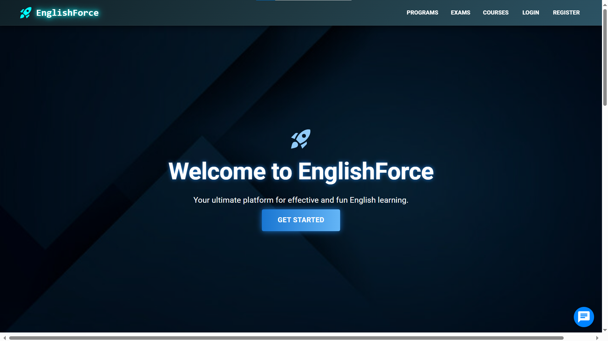
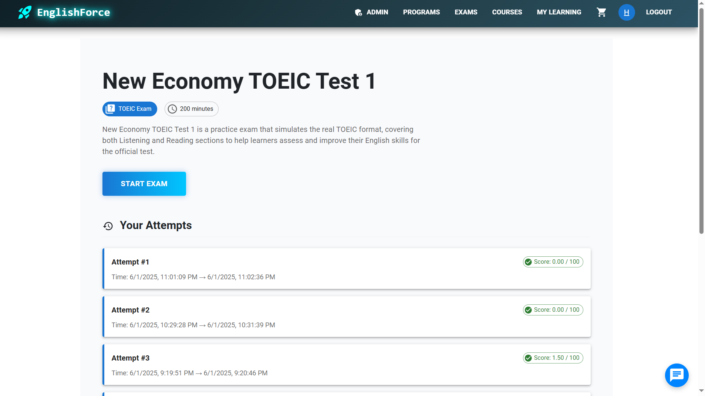
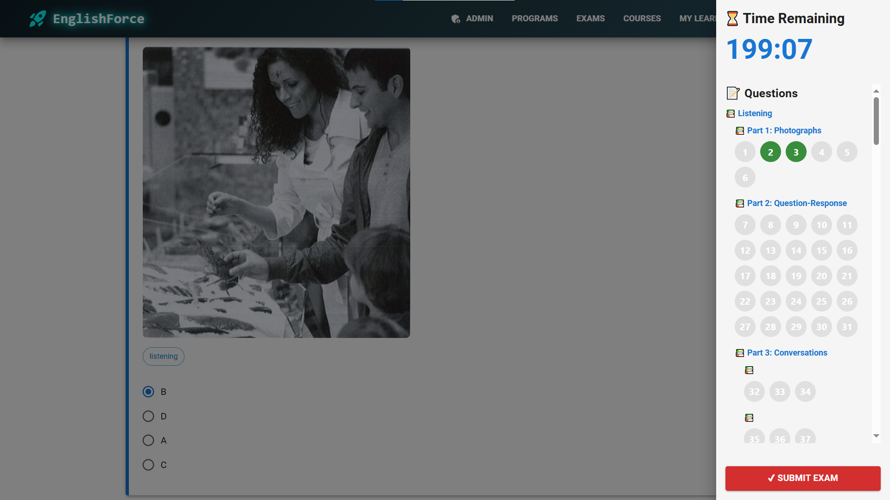
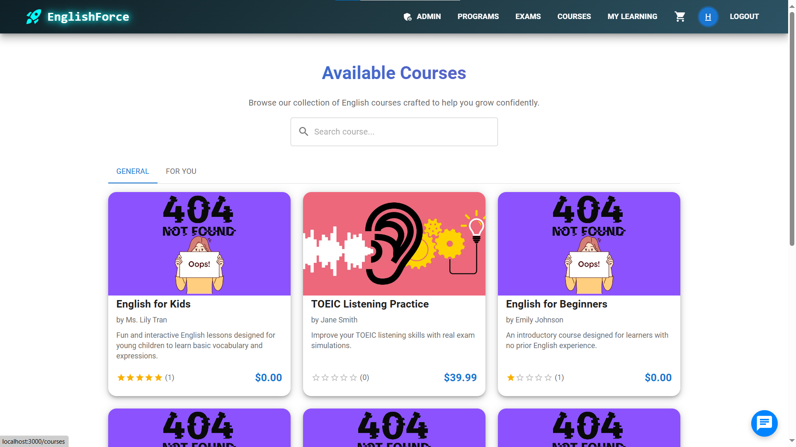
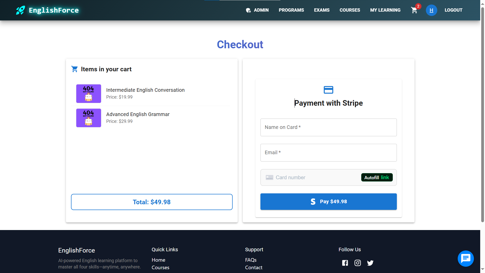
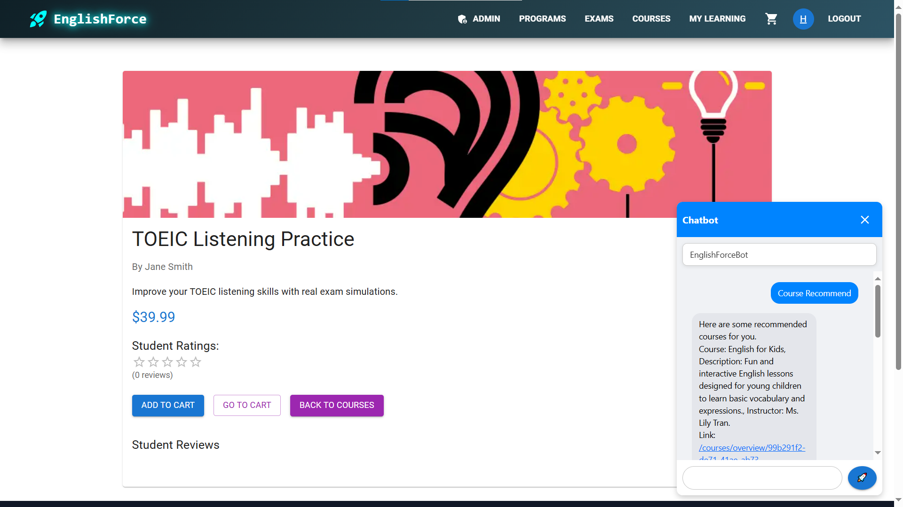

# English Force

**This project is my Graduation Project in University (Final Year Project) focused on developing an online English learning platform.**

English Force is an online English learning platform that helps users study effectively through diverse courses, lessons, exercises, and exams. The project consists of three main parts: a React frontend and a Node.js backend with PostgreSQL database and a FastAI backend that run my AI models.

---

## Introduction

English Force provides a comprehensive English course management system, including:

- Management of courses, learning programs, units, lessons, and exercises.
- Exams with multiple parts, questions, and answers.
- User system with role-based access control.
- Media upload and storage for videos, images, and audio recordings via Cloudinary.
- Tracking users’ learning progress.
- AI backend built with FastAPI that powers a retrieval-based chatbot and a hybrid recommendation system to enhance personalized learning experiences.

---

## Key Features

- Course and program management: Create, update, delete courses, programs, units, and lessons.
- Exercises and exams: Support various exercise types such as multiple-choice, speaking, writing; create exams with multiple parts and questions.
- User management: Registration, login, role management, and progress tracking.
- Media management: Upload images, videos, and audio files with Cloudinary.
- Comments: Users can comment on courses.
- Progress tracking: Store and display progress and scores for lessons and courses.
- AI-powered chatbot: Retrieval-based chatbot providing intelligent conversation and support for learners.
- Hybrid recommendation system: Personalized course recommendations combining multiple algorithms to enhance learning outcomes.

---

## Technologies Used

- Frontend: React.js, Material-UI (MUI)
- Backend: Node.js, Express.js, Sequelize ORM
- Database: PostgreSQL
- Caching: Redis
- Media Storage: Cloudinary
- Authentication: JSON Web Token (JWT)
- Containerization/DevOps: Docker & Docker Compose

---

## System Architecture

- Frontend: React single-page application (SPA) communicating via REST API.
- Main Backend: REST API using Express with Sequelize ORM to connect to PostgreSQL.
- Models include User, Course, CourseSection, Comment, Program, Unit, Lesson, Exercise, ExerciseAnswer, Exam, ExamPart, Question, Answer, ExamAttempt, UserCourse, UserProgress.
- Media uploads handled with Cloudinary for videos, images, and audio.
- Authentication and authorization based on JWT tokens and user roles (admin, user).
- A FastAPI service running machine learning models for a retrieval-based chatbot and a hybrid recommendation system, which provide intelligent interactions and personalized course suggestions.


## Screenshots

Below are some screenshots of **English Force**:

### Home Page



### Test Pages



### Course Pages



### Chatbot



---


## How to Run

> **Note:**  **create `.env` file from `env_example.txt`** for each service (FE, BE, AI)

### 1. Run with Docker

- Install Docker and Docker Compose
- From the project root directory, run:
```
docker-compose up -d
```

### 2. Run without Docker

#### Backend (Node.js + PostgreSQL)

1. Clone repository and install dependencies:
   ```bash
   git clone https://github.com/flow-of-water/english-force.git
   cd EnglishForce/EnglishForce-backend
   npm install
    ```
2. Set up PostgreSQL:

   Create a database named englishforce 

3. Run migrations & seeds

   If you need sample data, run the seeds.
   - Apply all seeds (in EnglishForce-backend folder):
   ```
     npx sequelize-cli db:seed:all
   ```
   - Undo all seeds:
   ```
   npx sequelize-cli db:seed:undo:all
   ```

   Login account (after seeding): username: `admin` / password: `Admin@123`


4. Start the backend:
   ```
   nodemon server.js
   ```
   Or 
   ```
   node server.js
   ```

#### Frontend (React)

1. Open another terminal:
   ```
   cd EnglishForce/EnglishForce-frontend
   npm install
   ```
2. Start the frontend:
   ```
   npm start
   ```
3. If run on production, npm run build and set up nginx

#### AI Service (FastAPI)

1. Open another terminal:
   ```
   cd EnglishForce/EnglishForce-AI/AIServer
   pip install -r requirements.txt
   ```
2. Run the server:
   ```
   python server.py
   ```